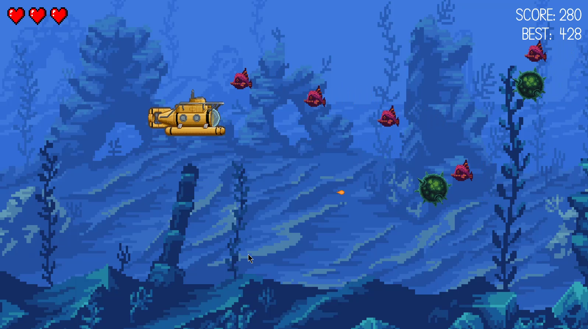

# Submariner

A 2D underwater game written in Java using LibGDX and Ashley.




### Controls:
- ```W``` - Up
- ```S``` - Down
- ```A``` - Backward
- ```D``` - Forward
- ```SPACE``` - Shoot
- ```P``` - Pause
- ```R``` - Restart
- ```F5``` -  Toogle debug grid
- ```F6``` -  Toggle hitbox indicators

### Assets:
- [Backround](https://opengameart.org/content/underwater-fantasy)
- [Fish & Bombs](https://opengameart.org/content/underwater-diving-pack)
- [Submarine](https://www.deviantart.com/darth-biomech/art/Submarine-626121234)
- [Explosion Sound](https://opengameart.org/content/boom-pack-1)
